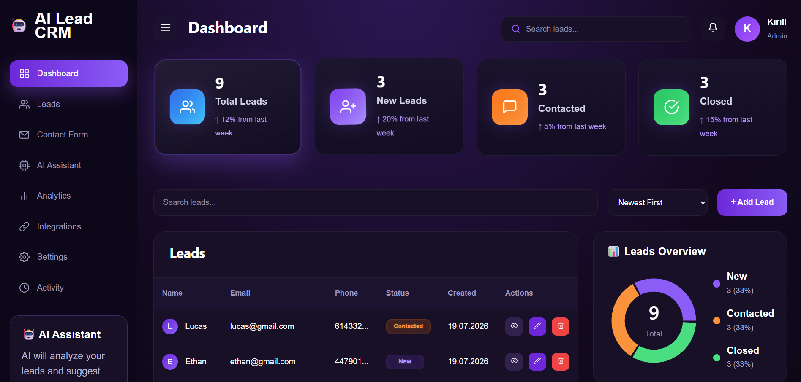
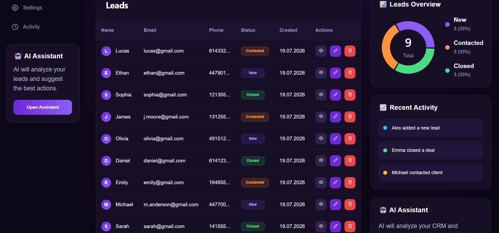
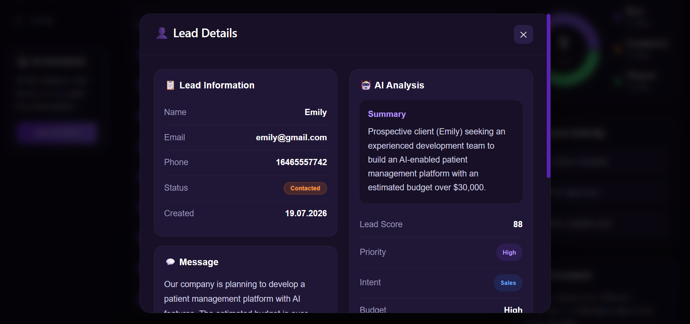
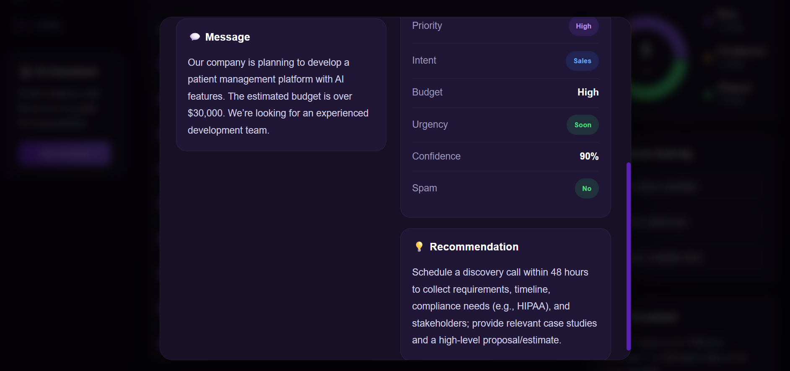
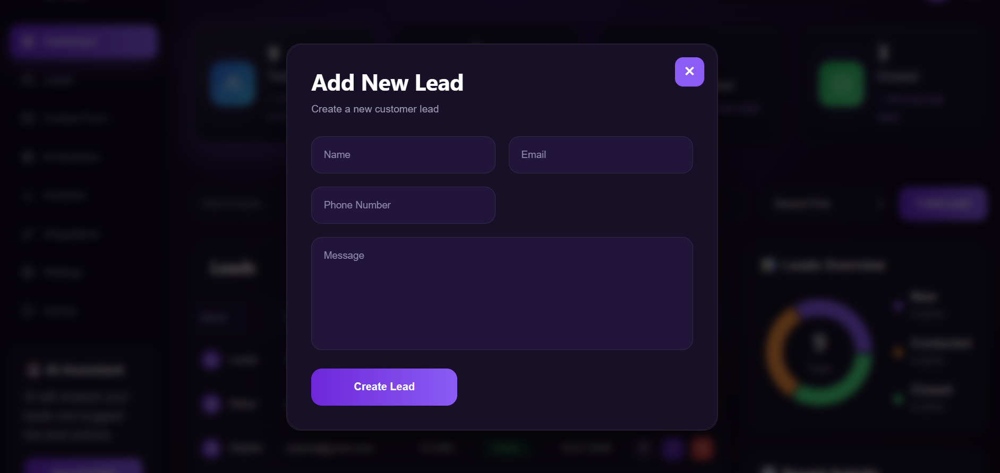
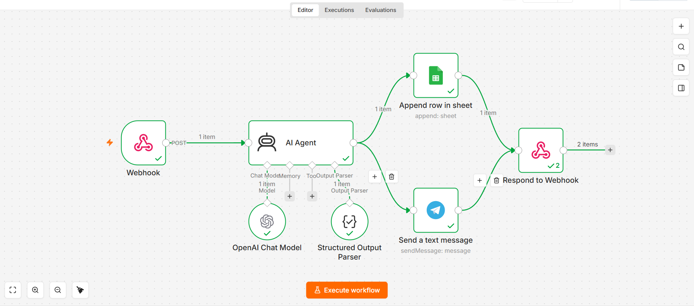
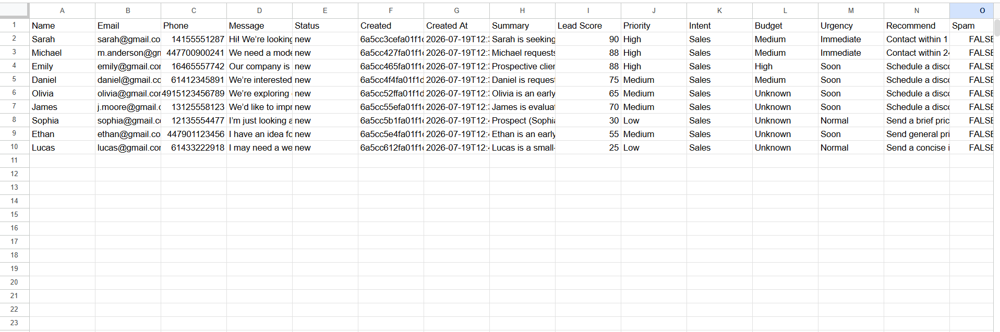
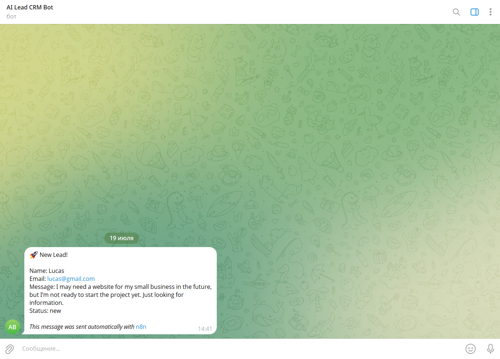

# AI Lead Management System

An AI-powered CRM that helps collect, manage, and analyze sales leads.

The application automatically evaluates every new lead using an AI workflow, generates business insights, and stores all information in a modern CRM dashboard. It also supports workflow automation through n8n, Google Sheets, and Telegram notifications.

---

## Preview

### Dashboard



### Leads Table



### AI Analysis





### Create Lead



### n8n Workflow



### Google Sheets Integration



### Telegram Notification



---

## Features

- AI-powered lead analysis
- Automatic lead scoring
- Priority detection
- Customer intent analysis
- Budget estimation
- Urgency evaluation
- Spam detection
- AI-generated summary
- AI recommendation for sales team
- Lead management dashboard
- Contact form
- Create, edit and delete leads
- Google Sheets integration
- Telegram notifications
- n8n workflow automation

---

## How it works

1. A customer submits a lead.
2. The backend stores the lead in MongoDB.
3. The lead is sent to an n8n workflow.
4. OpenAI analyzes the lead.
5. AI returns:
   - Lead Score
   - Priority
   - Intent
   - Budget
   - Urgency
   - Spam Detection
   - Summary
   - Recommendation
6. The CRM updates automatically with the generated information.
7. The workflow can also notify the sales team through Telegram and save the data to Google Sheets.

---

## Tech Stack

### Frontend

- React
- Vite
- React Router
- Recharts
- React Icons

### Backend

- Node.js
- Express
- MongoDB
- Mongoose
- Axios

### AI & Automation

- OpenAI
- n8n
- Google Sheets
- Telegram Bot API

---

## Project Structure

```text
backend/
│
├── src/
│   ├── controllers/
│   ├── models/
│   ├── routes/
│   └── services/
│
└── server.js

frontend/
└── vite-project/
    ├── components/
    ├── pages/
    ├── layout/
    └── assets/
```

---

## Installation

Clone the repository
```bash
git clone https://github.com/NeroDevX/ai-lead-management-system.git

Install backend dependencies

cd backend
npm install

Install frontend dependencies

cd ../frontend/vite-project
npm install
```
---

## Environment Variables

Create a .env file inside the backend folder.
```env
MONGO_URI=your_mongodb_connection
```
If you use your own automation workflow, update the webhook URL inside the backend service.

---

## Future Improvements

- Authentication
- User roles
- Email notifications
- Advanced analytics
- Search and filtering
- Docker support
- Deployment

---

## Author

Developed by Kirill Kliumsh as a personal portfolio project

GitHub:
**https://github.com/NeroDevX**

---

## License

This project is available for educational and portfolio purposes.